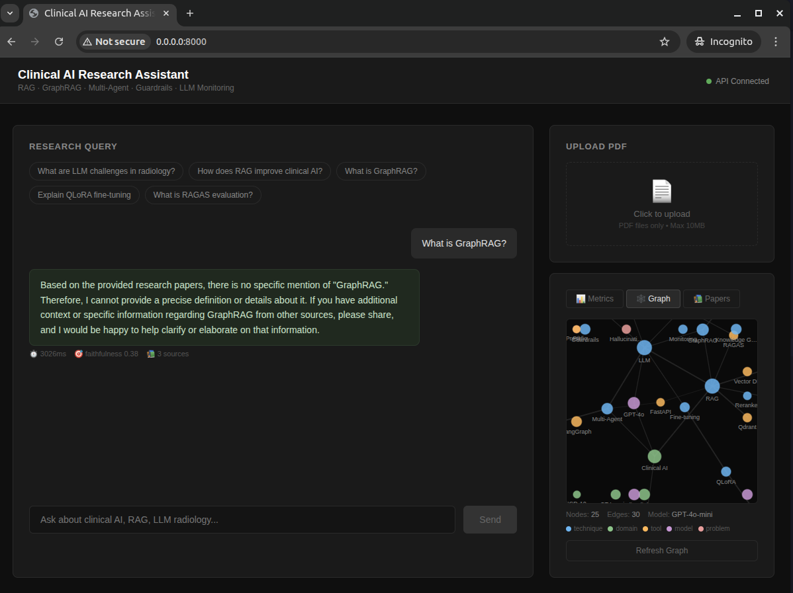

# Clinical AI Research Assistant

> **Production-grade LLM platform** for clinical AI knowledge retrieval — indexing radiology AI research papers with RAG, Multi-Agent reasoning, GraphRAG, and 7-layer Guardrails.

[](https://python.org)
[](https://langchain.com)
[](https://fastapi.tiangolo.com)
[](https://qdrant.tech)

---

## Demo



---

## Architecture
```
┌─────────────────────────────────────────┐
│         React Frontend (frontend/)      │
│  Chat UI · PDF Upload · Live Metrics    │
└──────────────────┬──────────────────────┘
                   │ REST API
┌──────────────────▼──────────────────────┐
│         FastAPI Backend (api/)          │
├─────────────────────────────────────────┤
│  7-Layer Guardrails                     │
│  Injection → PII → Topic → Quality      │
├─────────────────────────────────────────┤
│  LangGraph Multi-Agent DAG              │
│  RAG Agent → Draft → Critique → Synth  │
├─────────────────────────────────────────┤
│  RAG Pipeline                           │
│  Qdrant · Multi-Query · Reranker        │
├─────────────────────────────────────────┤
│  GraphRAG Knowledge Graph               │
│  39 nodes · 50 edges · GPT-4o-mini      │
├─────────────────────────────────────────┤
│  LLM Monitoring                         │
│  Hallucination · Drift · Latency · Logs │
└─────────────────────────────────────────┘
```

---

## Key Results

| Component | Metric | Value |
|-----------|--------|-------|
| RAG Pipeline | Answer Relevancy | **0.98** |
| RAG Pipeline | Context Recall | **1.00** |
| RAG Pipeline | Faithfulness | **0.84** |
| Guardrails | Injection Block Rate | **100%** |
| API | Avg Latency | 2150ms |
| API | P95 Latency | 2593ms |
| Fine-tuning | Training Loss | 5.66 → **3.98** |
| GraphRAG | Knowledge Graph | **39 nodes / 50 edges** |

---

## Clinical AI Papers Indexed

| # | Paper | Source |
|---|-------|--------|
| 1 | LLMs in Radiology: Trends and Trajectories 2025 | JMIR Medical Informatics |
| 2 | LLM Systematic Review for Radiology Reporting | medRxiv 2025 |
| 3 | MedTutor: RAG System for Case-Based Medical Education | EMNLP 2025 |
| 4 | AI in Healthcare: 2025 Year in Review | medRxiv 2026 |

---

## Components

### 1. RAG Pipeline (`rag/`)
- Multi-query rewriting: 3 search variants per question
- Qdrant vector DB with `all-MiniLM-L6-v2` embeddings
- Cross-encoder reranking: `ms-marco-MiniLM-L-6-v2`
- RAGAS evaluation: Faithfulness 0.84 / Relevancy 0.98 / Recall 1.00

### 2. Multi-Agent System (`agents/`)
- 4-node LangGraph DAG: RAG → Draft → Critique → Synthesis
- Self-correction loop with factuality validation

### 3. QLoRA Fine-tuning (`finetune/`)
- Base: Qwen2.5-1.5B-Instruct
- QLoRA 4-bit NF4, LoRA r=16
- Training loss 5.66→3.98, 0.28% trainable params, RTX 3090

### 4. LLM Monitoring (`monitoring/`)
- Hallucination detection (LLM-as-judge)
- Retrieval drift detection
- SQLite persistent logging, avg latency 1853ms, P95 2593ms

### 5. GraphRAG (`graph/`)
- GPT-4o-mini entity and relation extraction
- NetworkX directed graph: 39 nodes, 50 edges
- Multi-hop cross-document queries

### 6. LLM Guardrails (`guardrails/`)
- Input: Prompt injection, PII anonymization (Presidio), topic filter
- Output: Hallucination filter, answer quality check
- 7-layer pipeline, 100% injection block rate

### 7. REST API + React Frontend (`api/`, `frontend/`)
- FastAPI with 4 endpoints + Swagger docs
- React UI with PDF upload, chat, live metrics dashboard

---

## Quick Start
```bash
pip install -r requirements.txt
cp .env.example .env  # Add OPENAI_API_KEY
docker run -d -p 6333:6333 qdrant/qdrant
python rag/my_papers_data.py
python api/research_api.py
# Open http://localhost:8000
```

---

## Tech Stack

| Layer | Technology |
|-------|-----------|
| LLM | GPT-4o-mini |
| Agent Framework | LangGraph 1.1 |
| Vector DB | Qdrant |
| Embeddings | sentence-transformers/all-MiniLM-L6-v2 |
| Reranker | cross-encoder/ms-marco-MiniLM-L-6-v2 |
| Fine-tuning | QLoRA, PEFT, TRL |
| Evaluation | RAGAS |
| API | FastAPI |
| Knowledge Graph | NetworkX |
| Safety | Presidio, better-profanity |
| Hardware | RTX 3090 (24GB VRAM) |

---

## Author

**Hongcheng Jiang** — PhD ECE, UMKC (GPA: 4.0)

9 publications: CVPR · IEEE JSTARS · IEEE SMC · WACV · Infrared Physics & Technology

[](https://github.com/jianghongcheng)
[](https://www.linkedin.com/in/hongcheng-jiang-a31860181)
